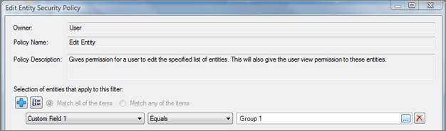
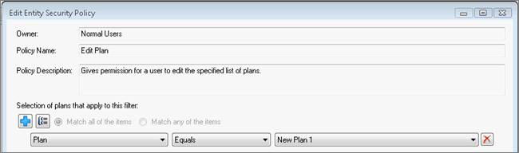

# Edit Policies

A security policy is a permission to perform an action in the project.
You can only edit the **Edit Entity, View Entity, and Edit Plans**
policies. The **Edit Entity** and **View Entity** policies use custom
fields to limit the entities a user can view or edit. See *Using Custom
Fields for User Security*, below. For an example of editing the Edit
Plans policy (which does not require the use of custom fields), see
Editing the “Edit Plans” Policy Example, below. 

Although only one Edit Entity or View Entity policy is displayed on the
Policies tab of the Security Setting dialog box, each policy is unique
for each user or role it is applied to. Therefore, when you select a
policy to edit, you must also select the user or role it is assigned to.

You can only edit a policy for a role or a user to which the policy has
been assigned *directly*. You cannot edit a policy if the policy is
*inherited* from a role.

## Using Custom Fields for User Security

Custom fields can be used to assign a user *view* and *edit* rights to
wells.

To create a custom field for user secruity, the administrator of the
project (or a user with administrator rights) should:

1.  [Configure Custom Fields](../../Entity%20Management/View%20and%20Organize%20Entities/Configure%20Custom%20Fields.md) and select
    **Requires administrative privileges to edit values**.
2.  For each well in the project, populate the custom fields on **Wells
    and General Economics \| Well Info and Custom Fields** with text
    that can be used to grant *view* or *edit* rights to users.
3.  In user security, assign roles or users a View Entity or Edit Entity
    policy and give them rights to view or edit entities that have
    ***X*** text in custom field ***X***.

See (Edit Policies, Create Roles, Assign Roles to Users, and Assign
Policies to Users).

## Editing the “Edit Entity” Policy Example

Project A has a custom field called Custom Field 1. Some wells in
Project A have the text *Group 1* in Custom Field 1. An administrator
can assign users the right to view or edit all wells in the project with
Group 1 in Custom Field 1, by assigning them the policy below.

To edit a the Edit Entity policy

1.  From the **Administration** menu, select **Security Settings**.
2.  Select the **Policies** tab.
3.  On the left, select the policy you want to edit.
4.  Under **Assigned To**, click the user (or role) for whom you want to
    edit the policy.
5.  Click Edit Policy.
6.  In the **Edit Entity Security Policy** dialog box, click
 to add a line to the filter.
7.  From the **Custom Fields** list, select the custom field that
    contains the text you want to assign to the user or role.
8.  From the custom field text list, select the custom field text you
    want to assign to the user or role.
9.  If you want to add more custom text fields to the filter, click
.
10. When you are done, click **OK**.

## Editing the “Edit Plans” Policy Example

To edit the Edit Plans policy, you do not need to first create custom
fields as you do to edit the Edit Entity or View Entity policies. When
you edit the Edit Plans policy, all plans in the project are
automatically listed in the filter dialog box, as displayed below. You
simply have to select the plan you want to allow a user or role to edit.

To edit a the Edit Plans policy

1.  From the Administration menu, select Security Settings.
2.  Select the **Policies** tab.
3.  On the left, select the policy you want to edit.
4.  Under **Assigned To**, click the user (or role) for whom you want to
    edit the policy.
5.  Click **Edit Policy**.
6.  In the **Edit Entity Security Policy** dialog box, click
 to add a line to the filter.
7.  From the **Plans** list on the right, select a plan you want to
    allow a role or user to edit.
8.  If you want to add more plans, click  and select
    another plan.
9.  When you are done, click **OK**.
