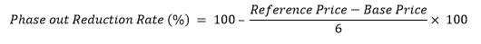

# US Fiscal Terms

This topic summarizes legislation concerning oil and gas projects in the
Lower 48 States of the USA, and is based on the Internal Revenue code of
1986. These fiscal terms differ from those applied to projects in Alaska
and the Gulf of Mexico.
Value
Navigator

The United States is unique in that most mineral rights are owned by
private land owners. Roughly 75% of onshore oil production in the lower
48 States is produced from privately-owned land. Therefore, royalty
rates, lease bonuses and fees are negotiable with the land owner or
mineral rights owner. While federal corporate taxation is rather
straightforward, severance tax, ad valorem tax and State taxes vary
greatly between States.

| Type | Concessionary (Royalty/Tax) |
|----|----|
| State Participation | None |
| Royalty | Negotiable with land/mineral rights owners, 1/8 to 1/4 |
| Bonuses | Lease bonuses, Delay Rental, and Shut-in Gas Royalties |
| Fees | None |
| Production Taxes | Severance and Ad Valorem taxes |
| Local Taxes | State income tax |
| Special Taxes | Incentive tax reductions and tax holidays |
| Corporate Tax | Federal tax is currently set at 35% |

## Royalty

Royalty is negotiable with land/mineral rights owners and is highly
variable. Since a field can straddle several pieces of privately-held
land it is common for there to be a variety of royalty rates within a
single field.

Rates are usually expressed in fractions, between 1/8 and 1/4. If
expressed in decimals, the calculations are carried out to seven decimal
places (i.e., ‘0.0000000’ or ‘00.00000%’).

Royalty is calculated on the basis of: ï‚· Gross revenue at the wellhead ï‚·
After gas gathering and handling costs

Many older leases allow reductions for the royalty's share of gas
gathering and handling between the wellhead and the first sales point;
however not all leases, especially the newer gas shale leases, allow for
the pro-rata application of gas gathering and processing costs.

Conventionally, royalty rates are implied in NRI and WI rates based on
the following formula:

> *NRI = Revenue Interest - (Royalty Rate x Revenue Interest)*

The rates apply separately to oil, gas, and by-products.

## Overriding Royalty

### Lease-Based ORRI

Lease-based Overriding Royalty (Lease ORRI) should not be confused with
ORRI payments between the working interest owners as part of a promoted
joint venture. Lease ORRI is calculated in the same manner as royalty
(i.e. as an additional royalty). Lease ORRI is often assigned in lieu of
other compensation to third party geologists and land men who helped
secure the lease. It is a burden shared by all working interest owners
on a pro-rata basis for the life of the production. Any later revisions
of working interest because of a promoted deal will require that the
pro-rata shares of the ORRI be re-calculated.

### Deal-Based ORRI

Deal-Based Overriding Royalty (Deal ORRI) are payments between the
working interest owners as part of a promoted joint venture. These
should not be confused with lease-based ORRI despite the similar name
(confusingly, companies often do not use the lease or deal identifiers).

Deal ORRI is normally calculated on the net working interest being
funded by the promoted deal; therefore, only the pro-rata share of the
Deal ORRI will be calculated in the same manner as royalty above (i.e.
as an additional royalty) and it is only paid by the working interest
participant subject to the deal.

ORRI application is often limited to "before payout" agreements which
could mean:

- On the well level: the pro-rata portion of the cost of the well being
  financed by the deal is greater than the pro-rata portion of the gross
  revenue after deducting the pro-rata share of all the fiscal terms
  above (i.e., severance and ad valorem taxes) plus the Deal ORRI, plus
  a pro-rata share of the lease operating costs
- On a project level: similar to the above except that all wells are
  considered, including dry hole costs
- On a field level: similar to the above except the cumulative net
  profit of the pro-rata share (as above) received by one party (usually
  an institutional investor funding an O&G company's participation in
  the field) exceeds a stated IRR.

After payout the interests in the deal change.

Overriding Royalty Paid can be gross or net, and paid or received
depending on farmor/farmee position.

## Bonuses

### Lease Bonus

Bonuses are payments negotiated between the land owner and the lessee.
They are made to the lessor on an upfront or instalment basis once the
lease is approved and executed.

Typically, bonus payments are much larger than delay rentals or shut-in
gas royalties.

### Delay Rental

This is a yearly payment based on number of acres not included in a
"pooled" production unit which is either producing or being drilled. In
some cases the Delay Rental is not paid if any part of the lease is
being produced or drilled. Some leases are paid-up meaning the bonus
includes both the signing and all potential yearly delay rentals.

### Shut-in Gas Royalty

This is a yearly payment made after a gas well has been drilled but
before production commences, if the cause is a delay or lack of market.
It is often calculated as a per-acre amount equal to the Delay Rental
per acre amount, multiplied by the number of acres in the pooled unit
assigned to the well. Payments do not usually commence until the end of
the lease term, whereas delay rentals are paid earlier and are limited
to two additional years.

Shut-in gas royalty terms are very flexible and often are used to extend
leases after gas production has been established and then later ceases
for a period longer than 60–90 days. The term is normally between three
and five years. Sometimes leases may be extended for an optional period
with an additional bonus payment at the end of the primary term.

If production is established and/or drilling commenced before the end of
the primary term, and continues with no gap of more than 60–90 days,
then no additional bonus, delay rental or shut-in gas royalty payments
are due. The acreage assigned to the pooled unit (and sometimes the
entire lease) is considered to be ‘held by production’ (HBP).

## Production Taxes

### Severance Tax

The severance tax is a production tax levied by some States when the
oil, gas, or by-products are severed from the well.

The rate varies by State and it is usually calculated as either a
percentage of the products’ value sold or consumed, or unit of product
volume (i.e. USD/bbl or USD/Mcf). Severance taxes are typically reported
and remitted on a monthly basis by the purchaser.

The rates are summarised in the Severance Tax: State Income Tax Rates
table below.

### Ad Valorem/Property Tax

The ad valorem tax is a tax levied at the county level based on either
the previous year’s production or the fair market value of equipment at
the well.

The tax rate and taxable basis vary widely between different local
jurisdictions. When production acts as the tax basis then oil, gas, and
by-products ad valorem is usually calculated as either a percentage of
the products’ value sold or consumed, or unit of product volume (i.e.
USD/bbl or USD/Mcf). It is standard in the oil and gas industry for cost
per unit volume is used as a proxy. Ad valorem taxes are typically
reported and remitted on a yearly basis by the operator.

### Tax Holidays

Tax holidays are State-level or county-level reductions on severance and
ad valorem taxes for oil, gas, or by-products. Tax holidays can take
many different forms and are used by Governments to meet certain policy
objectives. For example, tax holidays can be used to incentivize
producers to reinvest in exploration and development by reducing taxes
on new wells, or to provide relief to producers when oil prices fall
below a certain level.

## State Income Taxes

Most States levy a corporate income tax and these rates varies from
State to State. Federal taxable income is used as a base and is adjusted
by State-specific additions and deductions to arrive at a State taxable
income. State taxable income is then apportioned to each State based on
factors such as property, payroll, or sales volume.

The U.S. does not use ring-fencing when calculating an entity’s tax
liability.

| State | Severance Tax | State Income/Gross Receipt Tax Rate |
| --- | --- | --- |
| Oil | ByProducts | Gas |
| % | USD/bbl | % | USD/bbl | % | USD/Mcf |
| Alabama | 1.00 - 2.00 | - | 1.00 - 2.00 | - | 1.00 - 2.00 | - | 6.50 |
| Arizona | 3.125 | - | 3.125 | - | 3.125 | - | 4.90 |
| Arkansas | 5.00 | - | 5.00 | - | 5.00 | - | 6.50 |
| California (1) | - | - | - | 0.50383 | - | 0.50383 | 8.84 |
| Colorado | 2.00 - 5.00 | - | 5.00 | - | 5.00 | - | 4.63 |
| Florida | 8.00 | - | 8.00 | - | - | 0.172 | 5.50 |
| Georgia | - | - | - | - | - | - | 6.00 |
| Idaho | 2.50 | - | 2.50 | - | 2.50 | - | 7.40 |
| Illinois (2) | 3.00 - 6.00 | - | - | - | 6.00 | - | 9.50 |
| Indiana | 1.00 | - | 1.00 | 0.24 | 1.00 | 0.03 | 6.00 |
| Kansas | 8.00 | - | 8.00 | - | 8.00 | - | 7.00 |
| Kentucky | 4.50 | - | 4.50 | - | 4.50 | - | 6.00 |
| Louisiana | 12.50 | - | 12.50 | - | - | 0.111 | 8.00 |
| Maryland | - | - | - | - | - | - | 8.25 |
| Michigan | 4.00 - 6.60 | - | - | - | 5.00 | - | 6.00 |
| Mississippi | 3.00 - 6.00 | - | - | - | 6.00 | - | 5.00 |
| Missouri | - | - | - | - | - | - | 6.25 |
| Montana | 0.50 - 9.00 - 14.80 | - | - | - | 0.50 - 9.00 - 14.80 | - | 6.75 |
| Nebraska | 2.00 - 3.00 | - | - | - | 2.00 - 3.00 | - | 7.81 |
| Nevada (3) | - | - | 2.300 - 3.00 | - | - | - | 0.051 |
| New Mexico | 3.75 | - | - | - | 3.75 | - | 5.90 |
| New York | - | - | 3.75 | - | - | - | 6.50 |
| North Carolina | 2.00 | - | - | - | 0.40 - 0.90 | - | 3.00 |
| North Dakota | 5.00 | - | 2.00 | - | - | 0.0555 | 4.31 |
| Ohio (4) | - | - | - | - | - | 0.025 | 0.26 |
| Oklahoma | 7.00 | - | 7.00 | - | 7.00 | - | 6.00 |
| Oregon | 6.00 | - | 6.00 | - | 6.00 | - | 7.60 |
| Pennsylvania | - | - | - | - | - | - | 9.99 |
| South Dakota | 4.50 | - | 4.50 | - | 4.50 | - |  |
| Tennessee | 3.00 | - | - | - | 3.00 | - | 6.50 |
| Texas (5) | 2.30-4.60 | - | 4.60 | - | 7.50 | - | 0.75 |
| Utah | 3.00 - 5.00 | - | 4.00 | - | 3.00 - 5.00 | - | 5.00 |
| Virginia | 0.50 | - | - | - | 1.00 | - | 6.00 |
| Washington | - | - | - | - | - | - | Â |
| West Virginia | 5.00 | - | 5.00 | - | 5.00 | - | 6.50 |
| Wyoming | 4.00 - 6.00 | - | 6.00 | - | 6.00 | - | Â |
| Notes: (1) Instead of Severance tax, payment is made on a per unit basis for oil and gas assessment. (2) Illinois State income tax rate is inclusive of Corporate Income taxes (7%) and Personal Property Replacement Tax (2.5%). (3) Commerce Tax is applicable for income over USD 4,000,000 (Gross Receipts Tax). (4) Commercial Activity Tax based upon Gross receipts over USD 1,000,000 in lieu of Corporate Income tax. (5) Franchise Tax is applicable after the threshold limit of USD 1,130,000. |

## Corporate Tax

Resident and non-resident corporations (not subject to treaty
protection) in the U.S. are subject to a federal corporate income tax of
35% on a corporation’s calculated taxable income. Taxable income is
calculated as gross income less taxable deductions, which are discussed
in further detail below. Corporations are required to settle their
corporate tax liability annually.

The U.S. does not use ring-fencing when calculating an entity’s tax
liability. This allows an entity to deduct the losses of one project or
activity from the profits of another project or activity.

### Deductions

Taxes are calculated annually and are eligible for the following federal
deductions:

- All State taxes and royalties are deductible
- Intangible costs of drilling and development capital (IDC). The
  treatment depends on the type of company. Integrated producers: 70% of
  IDC is expensed immediately and 30% is depreciated on a 60-month
  straight-line basis. Independents: 100% IDC is expensed immediately
  (Note: An integrated oil company is a producer which is also either a
  retailer selling over USD 5 million worth of oil or gas in a year, or
  a refiner which refines over 50,000 barrels of oil on any day during
  the year)
- Tangible costs of facilities, platforms and drilling capital are
  depreciated using the modified accelerated cost recovery method, or
  MACRS (200% declining) basis over 7 years, using the halfyear rule
- Pipelines capital is depreciated on the MACRS (150% declining) basis
  over 15 years, using the halfyear rule
- Dry holes are expensed when the well is determined to be unsuccessful
- Lease Bonus is 100% capitalized and written-off via UOP depletion
  using 105% of proved reserves as the basis for productive leases.
  Undeveloped leasehold is an expense when the lease is abandoned or
  relinquished
- G&G and other exploration costs (exploration G&A) are capitalized for
  tax purposes and written off through depletion on the same tax basis
  as Lease Bonus
- Property acquisition/divestiture cost is depreciated on the UOP basis
- Abandonment costs are expensed for tax purposes ï‚· Fees and rentals
  (Delay Rental, Shut-in Royalty) are expensed as LOE
- Net operating losses (NOL) can be carried forward 20 years and are
  generally used on a firstin‑firstout basis. The Tax Cuts and Jobs Act
  of 2017 (TCJA) introduced a limit of 80% on the taxable income for
  offsetting carried-forward losses
- NOLs can be carried back two years and are generally used on a
  firstin‑firstout basis. The TCJA disallows carry back of NOLs arising
  in the tax year ending March 31, 2018
- Bonus Depreciation: Additional first year depreciation is allowed for
  qualified capital expenditure in additional to the
  otherwise-applicable depreciation method. The TCJA sets the Bonus
  Depreciation rate at 100% from 2018 to 2022, but after then it will be
  reduced by 20% each year, and eliminated from 2027 onwards. The table
  below summarizes the Bonus Depreciation rates applicable each year:

| Properties placed in Service Year | Bonus Depreciation Percentage (%) |
|-----------------------------------|-----------------------------------|
| 2018 - 2022                       | 100                               |
| 2023                              | 80                                |
| 2024                              | 60                                |
| 2025                              | 40                                |
| 2026                              | 20                                |
| 2027 onwards                      | 0                                 |

*Modified Accelerated Cost Recovery Method (MACRS)* is the United
States’ current method for depreciating expenses for tax purposes. The
useful life for tax purpose and method of depreciation are defined in
different capital classes.

### NOL Carry-Forward and Carry-Back Provisions by State

When businesses suffer losses in a calendar year, the corporate tax
codes allow them to deduct those losses against previous or future tax
returns. These provisions are called net operating loss (NOL) carry
backs and carry forwards.

While the federal code allows 20 years of NOL carry forwards and 2 years
of NOL carry backs, States vary widely on their policies for NOL, as
detailed in the following table:

| State          | State NOL Carry Foward Years | State NOL Carry Back Years |
|----------------|------------------------------|----------------------------|
| Alabama        | 15                           | 0                          |
| Arizona        | 20                           | 0                          |
| Arkansas       | 5                            | 0                          |
| California     | 20                           | 2                          |
| Colorado       | 20                           | 0                          |
| Florida        | 20                           | 0                          |
| Georgia        | 20                           | 0                          |
| Idaho          | 20                           | 2                          |
| Illinois       | 12                           | 0                          |
| Indiana        | 20                           | 0                          |
| Kansas         | 10                           | 0                          |
| Kentucky       | 20                           | 0                          |
| Louisiana      | 15                           | 3                          |
| Maryland       | 20                           | 2                          |
| Michigan       | 10                           | 0                          |
| Mississippi    | 20                           | 2                          |
| Missouri       | 20                           | 2                          |
| Montana        | 7                            | 3                          |
| Nebraska       | 20                           | 0                          |
| Nevada         | \-                           | \-                         |
| New Mexico     | 20                           | 0                          |
| New York       | 20                           | 2                          |
| North Carolina | 15                           | 0                          |
| North Dakota   | 20                           | 0                          |
| Ohio           | \-                           | \-                         |
| Oklahoma       | 20                           | 2                          |
| Oregon         | 15                           | 0                          |
| Pennsylvania   | 20                           | 0                          |
| South Dakota   | \-                           | \-                         |
| Tennessee      | 15                           | 0                          |
| Texas          | \-                           | \-                         |
| Utah           | 15                           | 3                          |
| Virginia       | 20                           | 2                          |
| Washington     | \-                           | \-                         |
| West Virginia  | 20                           | 2                          |
| Wyoming        | \-                           | \-                         |

## Enhanced Oil Recovery (EOR) Tax Credit

Internal Revenue Code, Title 26 (26 USC) establishes that the enhanced
oil recovery credit (against taxable income) for any taxable year is an
amount equal to 15% of the qualified enhanced oil recovery costs for the
same taxable year.

Qualified enhanced oil recovery costs include tangible and intangible
costs related to EOR projects and the cost of the injectant.

For federal income tax calculation, EOR tax credit amounts associated
with qualified capital and operating cost, are deducted from the
capital's depreciable basis or operating expense, respectively.

A price threshold applies after 1990. The EOR tax credit rate is reduced
by a rate calculated according to the following formula:

where Reference Price is the estimate of the annual average wellhead
price per barrel for all domestic crude oil. Gross Oil Price is used as
a proxy.
