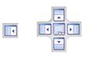

# Move the Summary/Properties Window or Entity Explorer

You can move the Entity Explorer and the Summary/Properties windows and
dock them in different locations within the interface or move them to a
different monitor.

To move windows

1.  Click the window near its name and hold the mouse button.
2.   Drag the window from its location. The window locator appears.
    

3.  While holding the mouse button, move the mouse pointer to one of the
    positions in the window locator. The corresponding location in the
    interface is highlighted in blue.
4.  Release the mouse button.
5.  To restore the default display, select Restore Default Layout from
    the View menu.

If you want to move either window to a different monitor you do not need
to use the window locator. Drag the window to the new monitor and
release the mouse button.
