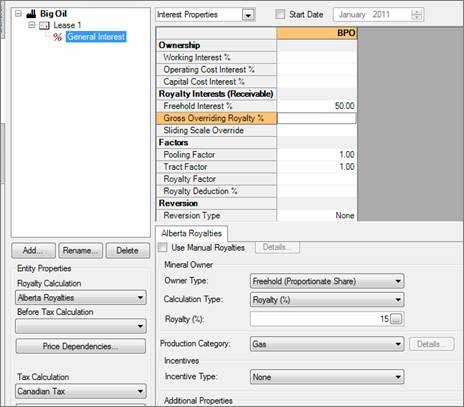
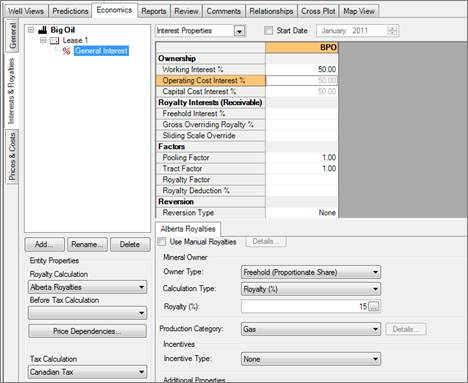

# Enter Freehold Royalties (Payable or Receivable)

If you are receiving a freehold royalty on a percentage of production,
enter that percentage in the Royalty Interests (Receivable) section,
under Freehold Interest %. If there is a working interest already on the
lease, it will have to be deleted entirely.

To enter a Freehold Mineral Owner royalty (payable or receivable)

1.  On **Economics \| Interest & Royalties**, select **Freehold** as the
    **Mineral Owner Type**.
2.  Do one of the following:
    | To | Select | And |
    |----|----|----|
    | Use the crown calculations for the province based on the production category selected for the interest, | **Crown Equiv.** for the Calculation Type | Finish. |
    | Enter a percentage, | **Royalty %** for the Calculation Type | Enter a percentage in the **Royalty** field. |
    | Enter sliding scale royalty parameters, | **Royalty %** for the Calculation Type | Click the ellipse in the **Royalty** field and enter the sliding scale parameters. |

## Example

### Freehold Owner

You own 50% of a freehold lease, and are being paid a 15% royalty by a
lessee. 

### Freehold Lessee

You have a 50% working interest in a well that pays 15% Freehold royalty
to your lessor:

