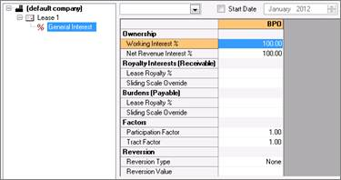

# Enter US Interests

Enter interests on **Economics \| Interests & Royalties**.

To select which interests are displayed, click the **Interest
Properties** list at the top of the screen and select the interests from
the list. Working Interest, and Net Revenue Interest are always
displayed.

## US ownership details

When you select a US entity and go to **Economics \| Interests
&Royalties**, two US-specific ownership interests are displayed:

- **Lease Revenue Interest (LRI):** The total amount of revenue interest
  available for the case. This is the Royalty Interest value for a 100%
  Working Interest and it is used in the calculation of the NRI value
  and the value of the Lessor Royalty Payable.
- **Net Revenue Interest (NRI)**: The owner’s share in the Production
  and Revenue.

You can enter the NRI or it can be automatically calculated.

The NRI calculation:

NRI = WI \* \[(1-GORp)\*(1-NORp)\*(1-NPIp)\] + (1-WI) \* \[1 -
(1-GORr)\*(1-NORr)\*(1-NPIr)\]

- Changing the WI recalculates the NRI, not the Royalty.
- If you enter a Sliding Scale override, a flat number for the NRI can
  no longer be determined so **\** is displayed.

## Ownership and Payable/Receivable Grid Interaction

- Entering an LRI generates the equivalent Royalty value in the Burdens
  section
- Entering an NRI generates the equivalent Overriding Royalty value in
  the Burdens section
- Entering a Royalty % Burdens calculates the equivalent LRI
- Receivables are always considered in the NRI calculation on the Grid
  unless the WI is 0. Receivables are always considered in the final
  calculations on the output reports.

## Entering Data in the Interests Grid

The following scenarios represent some of the different data entry
methods available for the Interests grid.
