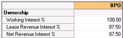
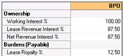
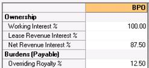

# Scenario 1: Simple Lessor Royalty Exists

Mr. Z owns the mineral rights in some land in Texas.

He leases this land to Raven Resources, reserving a 1/8 royalty. (12.5%)
Raven has a 100% Working Interest.

Generally speaking, you should select the options below in this
scenario:

- **Option A**: Select this if you know your Lease Revenue Interest and
  the NRI.
- **Option B**: Select this if you know the burden information.
- **Option C**: Select this if you only have an NRI value.

To enter this case you could use any of the following options:

- A\) Enter the Lease Revenue Interest (Figure 1)

  

  Figure 1: The Lease Revenue Interest has been entered as 87.5

  The NRI is calculated: **WI \*LRI**

  The Lessor Royalty payable is calculated: **(100%-LR%)%**

- B\) Enter the Royalty payable value (Figure 2)

  

  Figure 2: The Royalty payable value has been entered as 12.5

  The Lease Revenue Interest is calculated: 100%-Royalty % and the NRI
  are calculated: **WI \*LRI**.

- C\) Enter the NRI you already calculated (Figure 3)

  

  Figure 3: Enter the NRI

  The Overriding Royalty payable is calculated: **I-NRI/WI**
