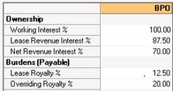
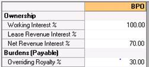

# Scenario 2: Lessor and Overriding Royalty Exist

Mr. Z owns the mineral rights in some land in Texas. He leases this land
to Raven Resources, reserving a 1/8 royalty. (12.5%) Raven has a 100%
WI. Raven Resources decided they need another investor so in exchange
for an investment they offer Investor ING an Overriding Royalty of 1/5
(20%) of Raven Company’s Interest.

Generally speaking, you should select the options below in this
scenario:

- **Option A**: Select this if you know your Lease Revenue Interest and
  the NRI.
- **Option B**: Select this if you know the burden information.
- **Option C**: Select this if you only have an NRI value.

To enter this case you could use any of the following options:

- A)  Enter the Lease Revenue Interest (LRI) and the Net Revenue
  Interest (NRI) you already calculated (Figure 1).

  

  Figure 1: Enter the LRI (87.5) and the NRI (70)

  In Option 1, the Lease Royalty % is calculated: **100%-LRI%=12.5%.**

  The Overriding Royalty is also calculated: **(I-NRI/WI(I-royaltypay))=
  20%**

- B)  Enter the Lease Royalty % Payable (12.5%) and the Overriding
  Royalty Payable (20%) (Figure 2).

  

  Figure 2

  The LRI and NRI are calculated.

- C)  Enter the NRI you calculated (Figure 3)

  

  Figure 3

  The Overriding Royalty% is calculated: **I-(NRI/WI)**
