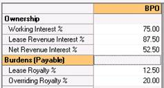

# Scenario 3: Lessor and Overriding Royalty Exist; WI is less than 100%

Mr. Z owns the mineral rights in some land in Texas. He leases this land
to Raven Resources, reserving a 1/8 royalty. (12.5%) Raven has a 100%
WI. Raven Resources decides they need another investor so in exchange
for an investment they offer Investor ING an Overriding Royalty of 1/5
(20%) of Raven Company’s Interest. Raven Company determines they still
needs more investment, so they find a partner, JVA Exploration, and
assign them a 25% WI.

Generally speaking, you should select the options below in this
scenario:

- **Option A**: Select this if you know your Lease Revenue Interest and
  the NRI.
- **Option B**: Select this if you know the burden information.
- **Option C**: Select this if you only have an NRI value.

To enter this case you could use any of the following options:

If you already created the case with a 100% Working Interest (like
Scenario 2) then simply changing the WI will recalculate your NRI as
required.

A\) Enter the WI, LRI, and NRI (Figure 1)

Figure 1: The lease royalty % (12.%) and the overriding royalty % (20%)
are calculated.

B\) Enter the WI, Lease Royalty Payable, and Overriding Royalty payable
(Figure 2)

Figure 2: The LRI and NRI are calculated.

C\) Enter the WI, and the NRI you calculated (Figure 3).

Figure 3: The lease royalty % (12%) and the overriding royalty % (20%)
are calculated.
