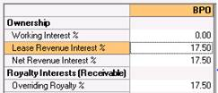

# Scenario 4: Overriding Royalty Receivable with 0 WI

You are ING Investment company and you have a 17.5 % royalty receivable
with no Working Interest.

To enter this case:

Enter **0** WI and an Overriding Royalty Receivable. This automatically
calculates your NRI as the equivalent of **Royalty% +Overriding Royalty
%+NPI +Sliding Scale receivable**.

