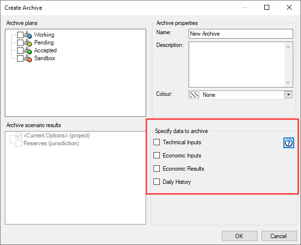

# Create an Archive

See [Archive Data](Archive%20Data.md)
for an overview of archiving.

To create an archive

1.  From the Administration menu, select **Archive Manager**.
2.  In the **Archive Manager** dialog box, click **Create**.
3.  In the Create Archive dialog box, under Archive Plans, select the
    plans you want to include in the archive.
4.  Under Archive scenario results, select the scenarios you want to
    include.
5.  Enter a name and description for the archive and select the
    following options as required:
    

6.  Click **OK**.

## Archive Options Data Summary

The table below describes the data included in each of the five archive
options. 

| Category | Technical Data - Declines Only | Technical Data - Declines and Other Technical Inputs | Economic Data - Economic Results | Economic Data - Economic Results and Basic Inputs | All Data (Full Archive) |
| --- | --- | --- | --- | --- | --- |
| Entity Data |
| Entity types | wells, groups, type wells, BWG | wells, groups, type wells, BWG | wells, groups, BWG, CTE | wells, groups, BWG, CTE | wells, groups, type wells, BWG, CTE |
| Well, Well-Plan (selected), Well-ResCat properties | Yes | Yes | Yes | Yes | Yes |
| Custom fields / hierarchy data | Yes | Yes | Yes | Yes | Yes |
| History and history cumulatives | Yes | Yes | No | No | Yes |
| Active Forecast inputs | Yes* (change hard links to soft links) | Yes | No | No | Yes |
| Forecast cache | Yes | Yes | No | No | Yes |
| Volumetrics | No | Yes | No | No | Yes |
| P/Z and pressure tests | No | Yes | No | No | Yes |
| Gas analysis | No | Yes | No | No | Yes |
| Plant tab (efficiencies, ratios, gas loss, energy content) | No | Yes | No | No | Yes |
| Daily data | No | Yes | No | No | Yes |
| General economic input | No | No | No | Yes | Yes |
| Prices | No | No | No* (except price set name for reports) | Yes | Yes |
| Costs | No | No | No | Yes | Yes |
| Interests | No | No | No | Yes | Yes |
| Custom regime fields | No | No | No | Yes | Yes |
| Allowances | No | No | No | Yes* (updated Jan 2013) | Yes |
| All economic result tables | No | No | Yes | Yes | Yes |
| Break even results | No | No | No | No | No |
| Unselected plans | No | No | No | No | No |
| Predictions \|Workspace forecasts | No | No | No | No | No |
| Entity history records | No | No | No | No | No |
| Entity comments | No | No | No | No | No |
| Change records | No | No | No | No | No |
| Vendor ids | No | No | No | No | No |
| Rollups, deleted entities | No | No | No | No | No |
| Global Data |
| Project settings | Yes | Yes | Yes | Yes | Yes |
| Entire fiscal context | No | No | No | No | Yes |
| Countries, provinces | Yes | Yes | Yes | Yes | Yes |
| Currencies | Yes | Yes | Yes | Yes | Yes |
| Companies | No | No | No | Yes | Yes |
| Custom field definitions | Yes | Yes | Yes | Yes | Yes |
| Pressure field definitions | No | Yes | No | No | Yes |
| Price set definitions | No | No | Yes* (empty except for name) | Yes | Yes |
| Exchange rate cache | No | No | Yes | Yes | Yes |
| Meter stations, facilities, transportation areas | No | No | No | Yes* (updated Jan 2013) | Yes |
| Custom regimes | No | No | No | Yes | Yes |
| Hierarchy definitions | No | No | No | No | Yes |
| Project history | No | No | No | No | No |
| Plan definitions | Yes | Yes | Yes | Yes | Yes |
| Calculated Plan Definitions | No | No | Yes | Yes | Yes |
| Batch definitions | No | No | No | No | No |
| Jurisdiction definitions (added Jan 2013) | No | No | Yes | Yes | Yes |
| Scenario definitions | No | No | Yes | Yes | Yes |
| Users | No | No | No | No | No |
| Filters | No | No | No | No | No |
| Security | No | No | No | No | No |
| Change record types | No | No | No | No | No |
| Jurisdictions | No | No | No | No | Yes |
