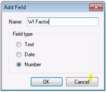
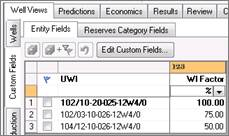

# Create a Working Interest Rollup

Creating a working interest roll up requires you to create a custom
field that you use to hold a Factor value. You then add a factor value
to each entity in the rollup. The factor value is applied to each
entity's history, forecast, daily data, P/Z, and volumetrics when the
roll up is calculated.

To create a working interest roll up

1.  [Configure Custom Fields](../../View%20and%20Organize%20Entities/Configure%20Custom%20Fields.md) to hold the factor
    value. The custom field must be a **Number** field.
    

2.  On **Wells \| Custom Fields**, enter a value in the custom field for
    each entity in the rollup and save the edits.
    

3.  [Create a Group or Rollup](../Create%20a%20Group%20or%20Rollup.md). You can select the
    custom field holding the Factor value. The factor values you entered
    for each entity are applied to each entity and used in the roll up
    calculations when the rollup is created.
    

    If you select a **Factor**, entities without a value in the factor
    custom field are not included in the rollup calculations.

    
