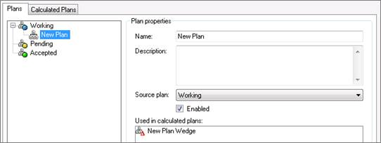
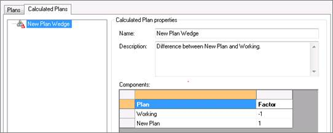

# Calculated Plans

Calculated plans enable you to define calculations between
[Plans](../Plans.md) and view the
incremental results in each reserves category.

You can view, create, and edit calculated plans on the Calculated Plans
tab of the Plans dialog box (**Tools** \&gt; **Global Project Data** \&gt;
**Plans**).

## Automatically Created Calculated Plans

When you create a plan,
Value
Navigator automatically creates a calculated plan with the same
name + “Wedge”, as displayed below.

This automatically created “wedge plan” is already configured to
calculate the incremental difference between the plan you created and
its parent (in this case “Working”), as displayed below.

## Calculated Plans Reporting

You can report on calculated plans in the same way you can report on
plans.
