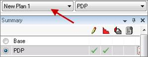

# Create a Plan

See [Plans](Plans.md) for an overview of
plans.

If the Plan filter at the top of hierarchy () is enabled,
only entities with data in the current plan are displayed. See [Filter to Entities with Data in the Current Plan](../../Filter%20Entities/Filter%20to%20Entities%20with%20Data%20in%20the%20Current%20Plan.md).

To create a plan

1.  In the **Tools** menu, point to **Global Project Data** and select
    **Plans**.
2.  In the Plans dialog box, click **Add**.
3.  Enter a name and description for the new plan and select the
    following fields as required:
    | Field | Description |
    |----|----|
    | Source plan | Data source for the new plan. If you want to create a standalone plan, do not select a **Source**. To create a plan that inherits data from a source, select a reserves plan (Working only) or another plan. |
    | Enabled | The plan is only displayed in the project if it is enabled. Disabled plans are not visible. |
    | Secure | If selected, only users with the **Edit Secure Plan Data** security policy can edit the plan. |

    
4.  Click **OK**.

To view the new plan in your project, select it from the list above the
Summary window.

