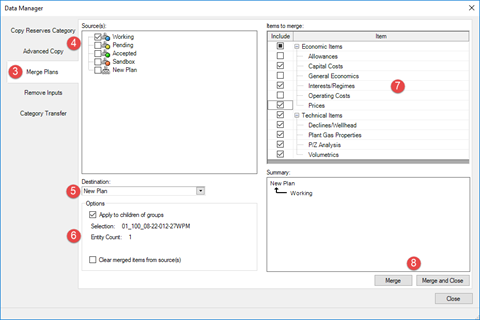

# Merge Plans

Use the Merge Plans feature to merge economic and technical inputs
between plans. You can merge plans to perform tasks such as moving a
budget plan into a reserves plan. Merging plans will replace data in the
destination plan with only the selected data from the source plan for
the selected entities.

When creating a stand-alone plan, you must enter inputs manually for the
new plan, or merge them from another plan.

The two tables below illustrate the results when three plans are merged
(Plan 1 is the destination plan).

| Before Merge Res Cat | Plan 1 | Plan 2 | Plan 3 |
| --- | --- | --- | --- |
| Common | Cost 3 Interest 2 |  |  |
| PDP | Forecast 4 Cost 4 Interest 3 |  |  |
| PD |  |  |  |
| TP | Forecast 2 Cost 5 |  |  |

 
After
Merge
| Res Cat | Plan 1 | Plan 2 | Plan 3 |
| --- | --- | --- | --- |
| Common | Cost 1 | Cost 3 Interest 2 | Â |
| PDP | Forecast 1 Cost 2 Interest 1 | Cost 4 Interest 3 | Forecast 4 |
| PD | Â | Â | Â |
| TP | Â | Forecast 2 Cost 5 | Â |

To merge plans

1.  If required, filter to the entities you want to merge.
2.  From the **Entity** menu, select **Data Manager** and click **Merge
    Plans**.
    

     You can also access the Data Manager from the **Summary** window:
    Right-click and select **Merge Plans**.

    
3.  Under **Source(s)**, select the plans you want to merge.
4.  From the **Destination** list, select the destination plan.
5.  Select the following options, as required:
    | Option | Description |
    |----|----|
    | Apply to children of groups | If selected, child wells are merged. |
    | Clear merged items from source(s) | If selected, all merged items in the source plan are cleared. |
    | Items to Merge | Only selected items are merged. |
6.  Ensure the **Entity Count** matches the number of entities you
    intend to merge.
7.  Click **Merge** or **Merge and Close**.
