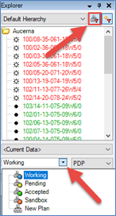

# Plans

Plans enable you to use each entity in your database for multiple
purposes and share the calculation results with other plans. For
example, you could use one entity in a reserves plan and a budgeting
plan in the same project, or have data from multiple sources that you
want to keep separate.

By default, four plans are created in any new database; Working,
Pending, Accepted and Sandbox. Only Working, Sandbox and custom plans
created by users, can be directly edited.

Custom Plans look and behave like the reserves plans Working, Pending
and Accepted. You can create and modify custom plans in
Tools \&gt; Global Project Data \&gt; Plans.
Like reserves plans, custom plans include technical and economic
information about entities. The Comparison
tab is a convenient place to see the differences between wells in
different plans.

- A new Plan can be created as a child Plan, allowing you to inherit
  inputs from the parent plan, but also enter inputs unique to that
  plan. Note that if a child plan entity becomes uneconomic, it will
  fall back to the parent plan’s economic result.
- A new Plan can be created as a stand-alone Plan, allowing you to enter
  input unique to that plan.
- Plans can be merged, allowing you to copy selected input from one Plan
  to another stand-alone plan for selected entities in the target Plan.
  Merging is not required when using a child plan, as it inherits the
  parent plan inputs by default.
- Plans can be calculated, e.g. the results from one Plan can be
  subtracted from the results of another Plan.
- Existing Plans can be deleted or unlinked from within the Plans editor
  window.
- Security can be applied to custom plans created by users.

Plans are selected from the Plans list box, directly
below the list of wells. To display only wells that have data in the
currently selected plan, use the Quick Filter icon to the right of the
Hierarchy Selector above the list of wells in the Entity Hierarchy. When
this icon is red, it is showing only wells that have data in the
selected plan. When this icon is grey, it is showing all wells,
regardless of whether they have data in the selected plan or not. Click
the icon to toggle between the two views.

If the Plan filter at the top of hierarchy () is enabled,
only entities with data in the current plan are displayed. See Filter
Entities with Data from the Current Plan.

See
[Create a Plan](Create%20a%20Plan.md).
