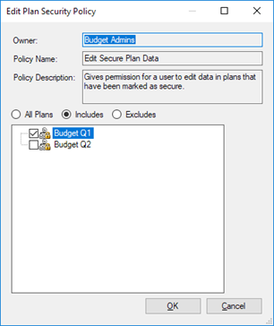

# Secure Plans

When you create a plan, you can specify it as secure. See
[Create a Plan](Create%20a%20Plan.md).

Only users with the *Edit Secure Plan Data* security policy are able to
edit secure plans. See [Assign Policies to Users and Roles](../../Administration/Configure%20User%20Security/Assign%20Policies%20to%20Users%20and%20Roles.md).

When you add the **Edit Secure Plan Data** security policy to a user or
a role, you must specify whether you want to include all secure plans or
only some, using three options: All Plans, Includes, and Excludes (see
below).

Changing certain entity information, such as an entity’s country or
product list, might result in changes to the plan data. Adding entities
to entity containers (such as groups, ring fences, or common termination
entities) can also affect economic results in secure plans.

