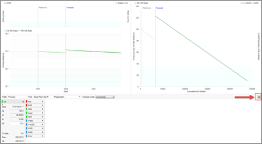
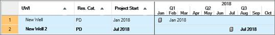

# Add or Adjust the Project Start Date

The Project Start Date acts as an anchor for forecast and cost start
dates. When you shift the Project Start Date, the forecast, capital, and
operating cost start dates move the same *relative* amount.

The Project Start date is not used in the PDP reserves category and only
affects costs entered as overrides.

You can adjust the Project Start date on **Predictions \| Declines** or
the **Timeline** tab.

## Adjust the Project Start date on Predictions \| Declines

On **Predictions \| Declines**, click  to access the
Project Start date or add it to the fields above the decline parameters
for easy access (see [Customize Predictions | Declines Fields](../../Customize%20the%20User%20Interface/Customize%20Predictions%20Declines%20Fields.md)).

## Adjust the Project Start Date on the Timeline Tab

The Timeline tab is displayed in the
[Using the Data View](../Using%20the%20Data%20View/Using%20the%20Data%20View.md). It is also displayed in
Entity View when you are viewing Schedules (in the Entity Types list
above the hierarchy).

To adjust the Project Start date, drag the schedule icon
() along the timeline and click Save (top left, above the
graph).

To adjust the Project Start date for several wells (when viewing a
Schedule only), highlight the row numbers and then drag the schedule
icon () along the timeline. Click Save (top left, above
the graph).

Two wells are selected by highlighting the row numbers. The dates of
both wells can be adjusted together.
