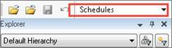

# Create a Schedule

Schedules are entities that sum the production and economics of their
child wells and display the wells on the Timeline tab so you can easily
view the combined production and timing of the wells. You can also move
wells on the Timeline to adjust their forecast start dates and other
dates such as capital and operating costs.  

Only wells with a Project Start date are displayed on the Timeline tab.
See [Add or Adjust the Project Start Date](Add%20or%20Adjust%20the%20Project%20Start%20Date.md).

To create a schedule

1.  From the **Entity** menu, select **Create \&gt; Empty Schedule**.
2.  Right-click, and select **Create as \&gt;** **Schedule**.
3.  Complete the **Entity Properties** and **Custom Fields** as
    required.
4.  Under Schedule Specific Options, select a **Plan**.
5.  Click **OK**.

To view your schedule, go to the Timeline tab. The Timeline tab is
displayed in the [Data
View](../Using%20the%20Data%20View/Using%20the%20Data%20View.md). It is
also displayed in Entity View when you are veiwing Schedules (in the
Entity Types list above the hierarchy).

