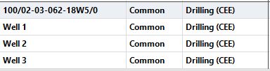
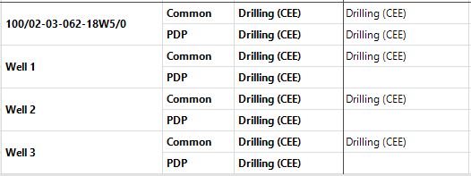

# Configure Data Displayed In Data View

Data View is ideal for auditing data input because it can display the
data from a large number of wells in a grid format, which makes it
apparent when data is missing or when data has been entered where it
shouldn’t have been.

To help verify that required inputs have been entered or identify where
inputs are missing or have been entered by mistake, you can select one
of the following three display modes for the tab’s rows:

| Selection   | Description                                       |
|-------------|---------------------------------------------------|
| Inputs Only | Displays only rows with input.                    |
| Show Gaps   | Displays all rows that have inputs in any entity. |
| All         | Displays all rows.                                |

For example, if your project should only include capital costs in the
Common reserves category and you want to confirm that capital costs have
not been entered in any other reserves category, under Rows, you can
click Reserves Category and select
Show Gaps (on Wells and General Economics
\|Capital Costs General). If capital costs have only been entered in
Common, only the Common row will be displayed for any entity, as
displayed below.

Show Gaps is selected under Reserves Category. Costs have only been
entered in Common.

However, if capital costs have been entered in any other reserves
category in any entity, that reserves category row will be displayed for
all entities, indicating that there is an entity with a capital cost in
that reserves category, as displayed below.

Show Gaps is selected under Reserves
Category on the right of Data View. Costs on one entity have been
entered in Common and PDP, but the PDP row is displayed for all
entities.
