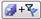

# Save Data in Data Views

When you edit data in Data Views, the edited data is displayed in blue
text. Data in blue text is not saved until you click Save
() or Save and Filter to Flagged Entities
().

You can undo edits you have not saved by clicking Undo
(). You cannot undo edits you have saved.
