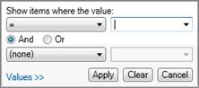

# Filter Data Grid Column Values

Use the procedure below to filter the data displayed in a Data View
grid. Data View column filters operate independently of the filters in
the Data View Layout Panel.

To filter column values in Data View

1.  Place your mouse pointer in the space above the column heading and
    click the filter icon.\
    The filter dialog box is displayed.
    
2.  Deselect values to hide them or click **Conditions** to create a
    filter.
    

3.  Click the list under **Show items where the value** to select a
    filter criterion.
4.  Next to the list, type a value.
5.  If required, click **And** or **Or**.
6.  Click the list **under And** or **Or** to select a second criterion.
7.  Next to the list, type a value.
8.  Click **Apply**.
