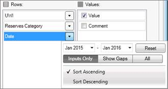

# Filter Dates in Data View

You can specify a date range for a Date row in the Data Views Layout
Panel by clicking the arrow on the right and selecting start and end
dates.

You can also use this date range to view dates for which there is no
data yet. To do this, specify the date extension you want to display in
the grid and select All (from Inputs Only/Show Gaps/All).  Selecting All
enables you to add data to date ranges not yet existing in your
database.

