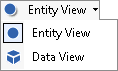

# Using the Data View

The Data View and Entity View options are different ways to view and
edit data in
Value
Navigator. Each view has its own set of tabs.

**The Entity View is designed for editing data on one entity at a
time.\**
The Entity View is the traditional
Value
Navigator view which features tabs such as **Predictions**,
**Economics**, and **Reports**. The **Well Views** tab**,** which
displays the data of several entities in a grid format, has been moved
to the **Data View**.

**The Data View is designed for editing and validating data on several
entities at once.**\
The Data View is a new view (in
Value
Navigator 2016) that displays data in a spreadsheet format.

To switch between the Entity View and the Data View, do one of the
following in the toolbar:  

| Select a view from the Data View/Entity View list Click the Data View/Entity View button to toggle between views | 

 |
| --- | --- |

Data View only displays user-entered data (inputs). See [Data Display in Data View vs. Entity View](Edit%20and%20Validate%20Data%20in%20Data%20View/Data%20Display%20in%20Data%20View%20vs%20Entity%20View.md).
