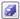
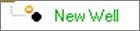

# Designate Entities as In Reserves or Out Of Reserves

To designate entities as In Reserves or Out of Reserves

1.  In the In Reserves column of **Wells and General Economics \| Well
    Info and Custom Fields**, select or deselect the checkbox.
2.  Click (save).

By default,
Value
Navigator filters the wells displayed in the explorer and in
Wells and General Economics \| Well Info and Custom Fields to
in-reserves entities. When all entities are being displayed in the
explorer, out-of-reserves wells are indicated with a yellow circle, as
displayed below.

If a well is not “In Reserves”, it is not included in any jurisdiction
calculations or reports even if it has not been removed from a
jurisdiction. Also see Exclude Entities from Jurisdictions.

See [Filter to In-Reserves Entities](../../Filter%20Entities/Filter%20to%20InReserves%20Entities.md)
