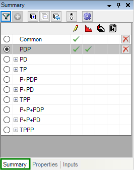

# Use the Summary, Properties, and Inputs Windows

## Summary Window

The Summary window is displayed below the Entity Explorer when you click
the Summary tab in the bottom left corner
of the screen.

The Summary window displays reserves categories or resource classes and
the types of data in each of them for the selected entity. The four data
types are described in the table below.

| Icon | Description |
|----|----|
| 

 | User input |
| 

 | Forecast data |
| 

 | Change records. You can remove this column in the summary panel options by clicking . |
| 

 | Economic data. You can remove this column in the summary panel options by clicking . |
| 

 | Deletes all data (user input, forecast, change records, and economics) in the reserves category for the selected entity |

### Configure the Summary Panel

You can configure the Summary window behavior to suit your workflow
using the options below.

| Icon | Function |
|----|----|
| 

 | Filters the list to only reserves categories or resource classes with inputs. |
| 

 | Adds another reserves category or resource class. Active only when the filter above is active. |
| 

0 | Expands/Collapses the list groups. |
| 

1

2 | When scrolling through entities, these buttons toggle between always displaying the first reserves category or resource class with inputs or always remaining on the currently selected reserves category or resource class. |

You can further configure the Summary panel display by clicking
Options (

3).

4

To copy data between reserves categories, see [Copy Reserves Category Data (and Advanced Copy)](../../Reserves%20Management/Manage%20Reserves%20Data/Copy%20Reserves%20Category%20Data%20and%20Advanced%20Copy.md).

Also see[Delete Reserves Category Data](../../Reserves%20Management/Manage%20Reserves%20Data/Delete%20Reserves%20Category%20Data.md), and
[Hide or Move the Summary/Properties/Inputs Window](#HideorMove).

## Properties Window

The Properties window is displayed below the Entity Explorer when you
click the Properties tab in the bottom
left corner of the screen.

The Properties window displays information for the entity selected in
the Entity Explorer. Fields in bold text are editable. Keep in mind that
changing some fields could affect the organization of the Entity
Hierarchy. See
[Create or Edit an Entity Hierarchy](Create%20or%20Edit%20an%20Entity%20Hierarchy.md) .

Also see [Hide or Move the Summary/Properties/Inputs Window](#HideorMove).

5

## Inputs Window

The Inputs window is displayed below the Entity Explorer when you click
the Inputs tab in the bottom left corner
of the screen.

Inputs are summarized for the current entity according to four views and
organized by area (Declines, Interests, General Economics, Costs, etc.).

6

Select one of the following views from the list at the top of the Inputs
window:

| View | Description |
|----|----|
| Entity | Displays all areas, plans, and reserves categories with inputs for the current entity. |
| Related Plans | Displays areas with inputs in the current plan or the current plan’s parent or child plans. |
| Active Reserves Category Inputs | Displays areas that have inputs in the current reserves category and plan. If an area is not listed, it either has no inputs or it inherits its data from another reserves category or plan. |
| Active Reserves Category Sources | Displays the source plan and reserves category for the inputs in the current plan and reserves category. |

You can jump to an area/plan/reserves category by right-clicking a row
and selecting **Go to source: \**. 

## Hide or Move the Summary/Properties/Inputs Window

You can hide or move the Summary/Properties/Inputs window by clicking
the icons in the top right corner of the window, as explained in the
table below.

If you have hidden or moved the Summary/Properties/Inputs window and
would like to return to the default layout, click **Restore Default
Layout** in the **View** menu.

| Icon | Description |
|----|----|
| 

7 | **Hide**: Closes the current window (Summary, Properties, or Inputs). **Floating**: The current window (Summary, Properties, or Inputs) is undocked from its default position. You can move it to another location or to another monitor. **Auto-hide**: The Summary/Properties/Inputs windows are hidden when not in use. A tab for each window appears to the left of the Entity Explorer. |
| 

8 | Causes the Summary/Properties/Inputs windows to be hidden when not in use. A tab for each window appears to the left of the Entity Explorer (same as clicking Auto hide, above). |
| 

9 | Closes the current window. |
