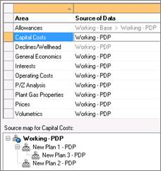

# View Data Sources

**Info \| Area Sources** displays the source of entity data (in the
current plan and reserves category), organized by area (such as
Allowances, Declines, Interests).

In the Source of Data column, areas without inputs (default data only)
are indicated in grey text.

When you click a row, a map of the data source relationships is
displayed below.

