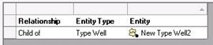

# View Entity Relationships

**Info \| Relationships** displays the relationships between an entity
and other entities, such as groups, well schedules, and type wells.

To view entity relationships

1.  In the Entity Explorer, select the entity whose relationships you
    want to view.
2.  Go to **Info \| Relationships**.
    

Double click the **Entity Type** or **Entity** to jump to it in the
Explorer.
