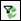

# Create a Filter Query

General well information and custom fields can be used to identify a set
of entities to filter to. The Filter dialog allows you to create complex
filters and save them for later use.

When a filter is applied to the project, the **Filter Well List** icon
is red .

You can access filters by selecting View
\&gt; Filter Well List or the
All Filters button ( ) on
the Standard toolbar.

When using the filter dialog box:

- You can use an asterisk (\*) as a wild card. For example, if you are
  searching for wells in the Gull Lake Basal Cantuar pool, but can’t
  remember the full name, you can enter **Pool + Like + Gull Lake\***.
- Some fields require filter keys for accurate results. For example, a
  filter which specifies **Decline=True** will return all wells with
  declines regardless of Reserve Category or Reserve Plan. Therefore, to
  return all wells that have a decline in the Working Copy of PUD, you
  must use the Reserve Category and Reserve Plan keys (**Decline=True
  AND Reserve Category=PUD AND Reserve Plan=Working**.) For this reason,
  filter keys are automatically displayed when you select a search field
  that requires them.

To create a filter query

1.  On the Standard toolbar click .
2.  In the **Filter** dialog box, click  to add a line to
    the query.
3.  In the new query line, select a field, operator, and value.
4.  Perform the following, as required:
    | To                               | Do this                            |
    |----------------------------------|------------------------------------|
    | Add another line to the query,   | Click .             |
    | Add a nested filter,             | Click .             |
    | Change the join type to **and**, | Select **Match all of the items**. |
    | Change the join type to **or,**  | Select **Match any of the items**. |
5.  If you have selected a search field that displays filter keys,
    select the appropriate operators and values for each key before
    adding another line or applying the filter.
6.  Perform one of the following, as required:
    | To | Do this |
    |----|----|
    | Save a new filter (or a modified filter with the original name) | Click **Save**. If you modify a previously-saved filter and click **Save**, the original filter is overwritten. |
    | Save a modified filter with a new name | Click **Save As**. Enter a name and click **OK**. |
    | Apply the query and close the filter | Click **OK**. |
    | Apply the query without closing the filter dialog box | Click **Apply**. |
    | Clear the current filter query | Click **Clear Active Filter**. |

If you create entities or edit entity properties that affect the filter
results, the results are not automatically updated. Use the **Reapply
Filter** button () to update the results.
