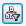
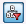
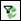

# Filter to Entities with Data in the Current Plan

All plans in a project contain the same wells, but all wells in a plan
will not necessarily have inputs.

For example, if you create a standalone plan and then merge only some of
the wells in the source plan to the new plan, only those wells have
inputs in the new plan—the other wells are displayed, but with no
inputs. Or, if you only override values for some wells in a child plan
(one that inherits data from another plan), the other wells are
displayed, but with no inputs (inherited values are not considered
inputs).

When the plan filter at the top of the hierarchy is enabled, only wells
with inputs in the current plan are displayed. This is useful for
displaying only the wells you are editing in the current plan.

To filter to entities with data in the currently selected plan

1.  Click  at the top right of the entity explorer.\
    Only entities with data in the current plan are displayed and the
    icon changes to .
2.  To clear the filter, click the icon again.

If you create entities or edit entity properties that affect the filter
results, the results are not automatically updated. Use the Reapply
Filter button () to update the results.
