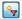
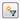
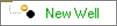
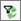
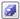

# Filter to In-Reserves Entities

By default,
Value
Navigator filters the wells displayed in the explorer and in
**Data View** to in-reserves entities.

## Notes on In-Reserves Entities

- When  is displayed at the top of the explorer, only
  in-reserves entities are being displayed. Click the button to remove
  the filter and display all entities.
- When  is displayed at the top of the explorer, all
  entities are being displayed. Click the button to apply the filter and
  display only in-reserves entities.
- When all entities are being displayed in the explorer, out-of-reserves
  wells are indicated with a yellow circle, as displayed below.\
  

- If a well is not “In Reserves”, it is not included in any jurisdiction
  calculations or reports even if it has not been removed from a
  jurisdiction. Also see [Exclude Entities from Jurisdictions](../Reserves%20Management/Jurisdictions/Exclude%20Entities%20from%20Jurisdictions.md).
- When you change the In-reserves filter setting, the setting is saved
  in your user configuration and applied to all projects you view until
  you change it.
- This filter affects the export of entities. If you export entities
  with this filter applied, only in-reserves entities are exported.

If you create entities or edit entity properties that affect the filter
results, the results are not automatically updated. Use the Reapply
Filter button () to update the results.

To mark or unmark an entity as In Reserves

1.  In the **In Reserves** column of **Wells and General Economics \|
    Well Info** **and Custom Fields**, select or deselect the checkbox.
2.  Click (save).
