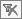

# Filter to a UWI List

This procedure explains how to filter your project to a well list. You
can select the wells to include in the list from the Multiple Value
Selection dialog box or import a list from another application (**.csv
or .txt** format). You can also filter to a list you exported from
Value
Navigator (**.txt** or **.lst** format). See [Export a Well List](../Importing%20and%20Exporting/Export%20Data/Export%20a%20Well%20List.md) .

When a filter is applied to the project, the **Filter Well List** icon
is red .

If you want to validate that wells exist in your project, see
[Validate a Well List](Validate%20a%20Well%20List.md).

To filter to a UWI list

1.  From the **View** menu, select **Filter to UWI List**.
2.  In the Multiple Value Selection dialog box, do one of the following:
    | To | Do this |
    |----|----|
    | Search for UWIs in the Available Items list, | Move items from the **Available Items** list to the **Selected Items** list. |
    | Type a UWI to search for, | Under Selected Items, type the UWI and click  to add it to the list. |
    | Import a well list, | Click **Import**. Browse to the file and click **Open**. |
    | Paste a list of wells | Paste a list of wells from your clipboard into the **Selected Items** list |
3.  Click **OK**.
4.  In the **Filter** dialog box, click **OK** to filter to the selected
    entities. If further filtering is desired, it is possible to refine
    your search. See
    [Create a Filter Query](Create%20a%20Filter%20Query.md).

If you create entities or edit entity properties that affect the filter
results, the results are not automatically updated. Use the **Reapply
Filter** button () to update the results.

To clear the filter query, click  on the Standard
Toolbar.
