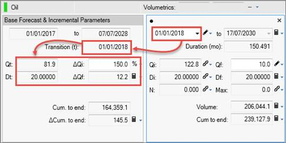

# Create an Incremental Forecast

On **Predictions \| Declines**, the Forecast Mode enables you to create
an incremental forecast using your existing “base” forecast as a
starting point. In Incremental mode, you only need to define the
incremental decline segment rather than recreating the entire forecast.

In Incremental mode, you can set a transition date and then increase
production (and costs, see [Enter Incremental Costs](../../Entering%20Economics/Enter%20Prices%20and%20Costs/Enter%20Incremental%20Costs.md)) at that date with a
relative or an absolute value.

You can also assign the incremental forecast a [project start
date](../../Entity%20Management/Schedules/Add%20or%20Adjust%20the%20Project%20Start%20Date.md)
that serves as an anchor for the start of the incremental forecast and
costs. You can then move the project start date to shift all the dates
at once.

As of ValNav 2017, Forecast Mode is set to Incremental by default in any
new project. However, for projects upgraded to 2017 or later, Forecast
Mode is set to Total by default, which is the original ValNav
functionality. As of version 2020, you can set the default forecast mode
in [Project Options: General](../../Options/Project%20Options/Project%20Options%20General.md).

To create an incremental forecast

1.  On **Predictions \| Declines**, in the PDP reserves category, select
    the **Incremental** forecast mode if not already selected (in the
    hamburger menu on the far right, above the decline parameters).
2.  Click the header above the forecast parameters to open the decline
    calculator.\
    The Base Forecast & Incremental Parameters are displayed on the
    left. The incremental forecast is displayed on the right.
    

3.  In the decline parameters on the right, adjust the incremental
    forecast’s start date.\
    The start date becomes the Transition time in the Base Forecast. The
    Base Forecast’s parameters are displayed below, as of the transition
    date.
4.  Do one of the following:
    | To | Do this |
    |----|----|
    | Increase the incremental forecast by a relative value, | In the **Base Forecast & Incremental Parameters**, enter a percentage in the **∆Qi**. |
    | Increase the incremental forecast by an absolute value, | In the decline parameters on the right, edit the Qi and other parameters. |

You can now create a Project Start Date for the incremental forecast
(and costs). Moving the Project Start Date moves the start of the
incremental forecast and costs all at once. See [Add or Adjust the Project Start Date](../../Entity%20Management/Schedules/Add%20or%20Adjust%20the%20Project%20Start%20Date.md).
