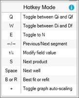

# Decline Editing Hotkey Mode

To make editing a large number of declines more efficient, you can enter
Hotkey Mode on **Predictions \| Declines** and use the keyboard to
quickly edit fields and move between wells.

To enter or exit Hotkey Mode

1.  On **Predictions \| Declines**, click .
2.  Click **Hotkey Mode**.

When you enter Hotkey Mode, **Predictions \| Declines** switches to the
product detail view with Qi automatically selected. A Hotkey legend
(below) is also displayed to the right of the product detail view.

The Hotkey functions are described below.

| Hotkey | Description |
|----|----|
| Q | Toggles between Qi/Qf |
| W | Toggles between Di/Df |
| F | Flags the current entity |
| E  | Toggles to N |
| Left/Right arrows | Switches to the next segment and select the matching field from the previous segment |
| Up/Down arrows | Modifies the selected value up or down by 1. For values, holding Shift modifies the value by .01. For percentages, holding Shift modifies the value by .1 |
| S | Switches between products |
| B | [Best Fit or Refit Wells](Best%20Fit%20or%20Refit%20Wells.md) the current product |
| R | [Best Fit or Refit Wells](Best%20Fit%20or%20Refit%20Wells.md)the current product |
| T | Adds the 'tail' exponential segment if you switch an exponential segment into a hyperbolic/harmonic segment. |
| C | [Set to Current](Set%20to%20Current.md) |
| Ctrl + R | Reloads the entity |
| Spacebar | Goes to the next entity |
| Shift + Spacebar | Goes to the previous entity |
