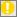

# Decline Errors and Warnings

When you edit the parameters of a decline segment on **Predictions \|
Declines** or **Predictions \| Workspace**, errors or warnings might be
displayed, as indicated by one of the following flashing icons:
 or .

## Errors

Segments with errors are excluded from the containing decline. All
segments coming after a segment with an error are also excluded from the
decline.

Error are caused by any of the following:

- Incorrect number of calculated parameters
- Di and Df have different signs
- The decline is exponential and Di and Df are both inputs.
- Sign of Di and Df are not consistent with Qi and Qf
- Segment volume and total volume are both inputs
- The specified parameters cannot be solved because the entered volume
  cannot be reached before the Max Life or because the Qf will never be
  reached.

## Warnings

Warnings are caused by any of the following:

- Segments with warnings are included in the decline but the values used
  in the segment calculations may not be the same as the parameters
  entered on the segment.
- Segment has no volume
- Earlier segment has an error (this segment will not be calculated).
- The segment extends beyond the life of the project

In the last case,  the segment volume will be reached at the Max Life of
the project, but the entered Qf may not be reached and the calculated
slope values will be calculated from the Qf at the Max Life, not the
entered Qf. If the desired slope is not being calculated, try entering
the slope and calculating the volume or Qf.
