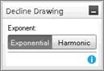

# Draw a Decline

You can draw declines on Predictions \| Declines
tab graphs. you can only draw a straight line, but
Value
Navigator will create a harmonic or hyperbolic curve if that best
fits the selection of production history.
Value
Navigator will use the slope exactly as it is drawn, and will
determine the initial forecast rate according to which of the two
methods you use, described below.

## Method 1: Drawing a Decline Before the Forecast Start Line

Value
Navigator transposes the slope to the forecast and gives the
segment a Qi equal to the last production rate.

## Method 2: Drawing a Decline through or after the Forecast Start Line

Value
Navigator uses the slope exactly as it is drawn. The Qi is
determined by the point at which the line crosses the forecast start
line.

To draw a decline

1.  On **Predictions \| Declines**, right click the graph you want to
    edit.
2.  Point to the decline type and select the **Draw** option you want to
    perform.\
    The Exponent option is displayed on the graph.
    

3.  Select **Exponential** or **Harmonic**.
4.  Hold the left mouse button and draw a slope.
5.  Release the mouse button.
