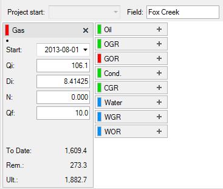

# Edit Decline Parameters on an Entity

You can use the product cards below the graphs on
Predictions \| Declines to enter decline
and ratio parameters and calculate multi-segment declines. The product
cards have a summary view (default) and a details view.

## Summary View

The summary view displays basic decline or ratio parameters if the
entity has them, or it just displays product names if the entity has no
decline or ratio. If an entity has no decline or ratio, click a product
name to create one.

|  |  |
|:---|:---|
|  |  |

If the entity has production,
Value
Navigator performs a best fit using the settings in your user
options (Fit Settings tab). If there is no production,
Value
Navigator creates a default decline or ratio using parameters
from your user options (Product Specific tab).

## Details View

The details view displays additional decline or ratio parameters and
enables you to specify user-entered or calculated parameters and add
decline segments. To switch from the summary view to the details view,
click the product name above the parameters.

## Calculate Decline or Ratio Parameters

To create the first segment in the calculator you use a combination of
user-entered values () and calculated values
(). In subsequent segments, you can also use linked
values () which are based on the preceding segment. If
you enter too many or too few values, an error symbol ()
is displayed at the top of the segment. Other errors, such as invalid
values, are indicated by a caution symbol (). Move your
mouse over the symbol to see the message. Also see
[Decline Errors and Warnings](Decline%20Errors%20and%20Warnings.md).

To add segments, click **Add Segment**. To remove a segment, click the
**X** in the top right of the segment.

To calculate a decline segment

1.  On **Predictions \| Declines**, click the product name above the
    decline parameters to display the details view.
2.  Enter or edit the **Segment Start Date** and **Initial Rate**
    (always user-entered values on the first segment).
3.  For each value you want to enter, toggle the icon next to the field
    to the user-entered icon  and enter the value.
4.  For each value you want calculated, toggle the icon next to the
    field to the calculated icon 

0.
5.  To add a segment, click **Add New Segment**.\
    The calculator determines the segment’s start date and initial rate
    and links them to the previous segment.
6.  Repeat steps 3-6 as required.

To change the fields displayed on **Predictions \|Declines**, see [Customize Predictions | Declines Fields](../../Customize%20the%20User%20Interface/Customize%20Predictions%20Declines%20Fields.md).
