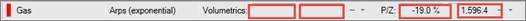
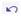
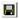
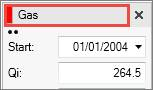
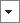
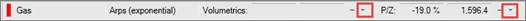
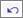

# Link a Decline to a P/Z or Volumetric Analysis

If you have P/Z or volumetric data, you can use it to plot the ORRGIP or
ORGIP for the well or group decline instead of using the gas or oil
ultimate derived from the decline analysis.

You can link the decline to the P/Z or volumetric analysis in the
detailed view on **Predictions \| Declines**.

The left field displays the difference (%) between the P/Z or volumetric
analysis and the decline analysis. The right field displays the amount
of gas reserves based on the P/Z or volumetric analysis.

Always save changes to the well *before* linking the decline to the
volumetrics or P/Z. This allows you to click **Reload
Entity**, to remove the link or (volume) and revert to
the original decline. If you save your project after linking the decline
to the ORGIP, you cannot unlink them with the **Reload Entity** button.
You must remove the link and redo the decline.

To link a decline to the P/Z analysis or

1.  Click the **Save** button  to save well changes.
2.  Go to **Predictions \| Declines** and click the product name to
    display the detailed view (if it is not already displayed).
    

3.  Click  next to **Volumetrics** or **P/Z**.
    

4.  Select **Link**.
    Value
    Navigator does one of the following:
    - Applies the P/Z Ultimate ORRGIP (adjusted for water production) as
      the Gas Ultimate and links the well to the Ultimate ORRGIP on the
      P/Z tab. Subsequent changes to the Ultimate ORRGIP on the P/Z tab
      are automatically applied to the decline.
    - Applies the Volumetrics OROIP/ORGIP as the Oil/Gas Ultimate
      without linking the well to the values on the Volumetrics tab.
      Subsequent changes to the OROIP/ORGIP on the Volumetrics tab are
      not automatically applied to the decline. To unlink the P/Z or
      volumetric analysis and the decline analysis, do one of the
      following:
    - If all well data was saved prior to linking and the link was not
      saved, click **Reload Entity**  to clear the link
      and return the decline to its original state.\&gt;
    - If the link has been saved, select No Link from the list next to
      P/Z and redo the decline.
