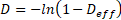
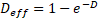
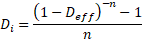
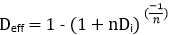
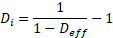
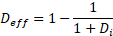
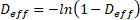

# Effective and Nominal Rates

| Decline Type | Description |
| --- | --- |
| Decline Factor Nominal 1 / year | The Decline Factor is the parameter D used in the decline equations. For the hyperbolic and harmonic formulations, the Decline Factor changes with time, so the factor is subscripted with i to indicate it is referenced to a specific time (t=0). Value Navigator sets its reference time to the last day of the most current month. This reference time is shown as Start Date on the Predictions tab |
| Use directly in equations Direct switch to exponential | Has no physical meaning Easily confused with effective decline factors |
| Effective Decline Secant Method % / year | This Effective Decline is the change in rate over the first year, expressed as a percentage of the initial rate. |
| Average decline over 12 months | Understates severity of early steep decline Convert for switch to exponential Cannot use directly in equations |
| Effective Decline Tangent method % / year | This Effective Decline is the instantaneous decline at a specified time. It is calculated as the 1st derivative of the rate time equation or from the slope of the tangent line to the rate time curve. See Decline Factor for the reference or specific time. |
| Direct switch to exponential Shows severity of steep decline | Imprecise for steep declines Has no physical meaning Cannot use directly in equations |

| Â | Exponential | Hyperbolic | Harmonic |
| --- | --- | --- | --- |
| Secant Method Conversion | 

 | 

 | 

 |
| Tangent Method Conversion | 

 | 

 | 

0

1 |

For more information, see [Edit Decline Parameters on an Entity](../Create%20and%20Edit%20Declines/Edit%20Decline%20Parameters%20on%20an%20Entity.md) .
