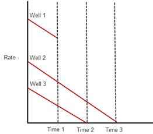

# About Type Wells

Type Wells display an averaged representation of the production history
for a sample of wells with a forecast based on that history.
Value
Navigator® normalizes the start of each well’s production history
to time zero and calculates an average of the combined history starting
from that date. It is possible to use either only history, or history
plus forecast in the normalization calculation. The forecast is then
based on the type well’s history, or history plus forecast

## Well Cut-off Point

Value
Navigator® does not automatically use all of the production
history for all wells in the sample to create a type well. The amount of
total production history used to create the type well is determined by
the percentage selected for **Well cut-off point** in the Create Type
Well dialog box. This applies if history or history + forecast is used
for the type well, but will have more influence on type wells that use
only history.

When looking at the production history of a sample,
Value
Navigator® starts all wells at a common start date. Because each
well has a different amount of production history, the sample’s well
count decreases over time. The **Well cut-off point** option allows you
to select what percentage of the wells is still producing (remaining)
before cutting off the production history. For example, if the sample
consists of 100 wells, entering 0% as the cut-off point runs all wells
to completion. In other words, 0% means “run all wells until 0%
remains.” Similarly, selecting 75% as the cut-off point runs the full
production history of 25 wells because once 25 wells have dropped from
production there are 75 remaining (Figure 1).

The higher the percentage indicated for **Well cut-off point**, the less
production history that will be used to create the type well (see Figure
1). Generally, the more wells used to create the type well (providing a
larger data sample), the higher the percentage that may be used. For a
small number of wells the percentage may be lower, resulting in a larger
amount of the available production history being used to calculate the
type well forecast.

**Figure 1**: The higher the % of wells remaining, the less production
history is used to create the type well. With 50% of the wells
remaining, 120 months of production are used to create the type well.
With 25% of the wells remaining, 180 months are used.

## Gap Wells and Shut in Wells

When only production history is used to create a type well, it is
important to distinguish between wells that have been shut in and those
that simply have no more production history. A gap well is a well that
has run out of production data, but is still assumed to be producing. A
shut in well is a well that has not produced for a number of months
greater than the [User Options: Import Parameters](../../Options/User%20Options/User%20Options%20Import%20Parameters.md#Max_Shut-in_Months) setting and does
not have a forecast which would indicate that production will resume in
the future.

The following explanation applies to type wells created using only the
production of the child wells (forecasts are not included).

Gap wells and shut in wells are used differently in the type well
calculation. When a gap well runs out of production data, the total well
count is reduced by one and the sum of all remaining wells’ production
is divided by the number of remaining wells. In other words, the gap
well is removed from the type curve calculation. Its production rate
assumes the average rate of the remaining wells. However, when a well is
shut in, the well count used to calculate the type curve is not reduced.
Therefore, the shut in well’s production, which is zero, is still used
to calculate the average production of the remaining wells.

See the graph below for an example of how the type well calculation
changes as gap wells run out of production data and wells become shut
in.

The term *well count* can have two different meanings depending on the
context. When determining the percentage of wells remaining to determine
the cut off point (see Well Cut-off Point, above), well count refers to
the number of wells contributing to production. The well count is
reduced when a well is no longer contributing to production (this means
both gap wells and shut in wells). In the context of the type well
calculation, the well count refers to the number of wells used in the
calculation. The number of wells used to calculate the type curve is
reduced when a gap well runs out of production data, but not when a well
is shut in.

| 

 | Time | Well Count | Type Curve Calculation |
| --- | --- | --- | --- |
| 0 to 1 | 3 | ∑ 3 wells’ production |
| 3 wells |

1 to
2
2

| ∑ 2 wells’ production |
| --- |
| 2 wells |

2 to
3
2

| ∑ 2 wells’ production |
| --- |
| 2 wells |

In the graph above, at Time 1, Well 1 has run out of production data,
but is not shut in and is assumed to be producing. At Time 2, Well 3 is
not producing and is considered a shut in well. At Time 3, only Well 2
is producing, but Well 3 is still being used in the type well
calculation with a producing rate of zero.

If the forecasts of the child wells are included, the well count used in
the type well calculation is always the total number of wells.
