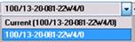

# Compare Economic Results between Entities

Use this procedure to compare archive, plan, reserves category, or
scenario results between entities.

To compare results between entities

1.  From the **Comparison** list at the top of **Comparison** **\|
    Economic**, select one of the following: **Cash Flow**, **Costs**,
    or **Production**.
2.  Select a **Currency**, if required.
3.  Select the required **Display Options**.
4.  In the Explorer, select an entity or folder, a reserves plan, plan,
    or calculated plan, and a reserves category.\
    The entity or folder is displayed in bold in the list at the bottom
    of the **Comparison** tab, prefixed with “Current”.
    

5.  To retain this selection in the list, click the UWI in the list, and
    select the UWI that is *not* prefixed with “Current”.
    

    

    If a selection is prefixed with “Current”, it is replaced each time
    you select a new entity or folder in the explorer and its plan and
    reserves category are replaced if you change the selection in the
    Summary window.

    
6.  Repeat steps 4 and 5 to add a new entity or entities to the list.
7.  **Optional**. [Set a Variance Baseline on the Comparison Tab](Set%20a%20Variance%20Baseline%20on%20the%20Comparison%20Tab.md).
8.  To display the results click **Calculate Table**.
9.  Select or deselect checkmarks in the selection list to display or
    hide results on the graphs.
10. To generate a report of the results, click **Show Report**.
