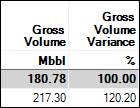

# Set a Variance Baseline on the Comparison Tab

When you view results on **Comparison \| Economic** or **Comparison \|
Technical**, you can set one row as the baseline and view the variance
from that baseline for all other results.

To set a row as the baseline, right-click the row and click **Set Row as
Variance Baseline**.

This row will be indicated by a blue arrow in the far left column
().

The **Variance %** columns always display 100% for the baseline row. For
all other rows, the **Variance %** columns display the variance
percentage from the baseline.

The[Run the Budget Report on Comparison | Economic](Run%20the%20Budget%20Report%20on%20Comparison%20Economic.md)on
**Comparison \| Economic** also displays the variances when you have set
a variance baseline.
