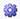

# Change Record Summary

The Change Record Summary displays the amount of all change records for
all products the entity or folder level.

To run the Change Record Summary

1.  From the Change Management menu, select Change Record Summary.
    

    You can also run this report in the Batch Manager.

    
2.  Select the following options below, as required:
    

    If you are running this report in the Batch Manager, click the
    **Options** button () in the Print Preview to select
    some options.

    

    | Option | Description |
    |----|----|
    | [Jurisdictions](../../Reserves%20Management/Jurisdictions/Jurisdictions.md) | The jurisdictions you want to run the report on. |
    | Run economics | Economics are run before the report is generated. Running economics ensures up-to-date values. |
    | Preview on entity selection | In the Print Preview, the report is generated when you select an entity. |
    | Working Interest report | Displays working interest results in the report |
    | Company Share report | Displays company share results in the report |
    | Net report | Displays net results in the report |
    | Show liquids details | Displays a section for every gas liquid with change record volumes in addition to the total. |
    | Summary Type (Batch Manager only) | Groups results by Summary Type. |
    | Category (Batch Manager only) | Groups results by change record Category type. |
3.  Select the share you want to report on and click **OK**.
4.  Click a folder level or entity to view the report.

If you do not select **Preview on Selection** in the bottom left of the
Print Preview, report results are not displayed when you select an
entity or folder. To display the results, click **Preview**.

If you select **Preview on Selection**, the report results are
automatically displayed when you select an entity or folder.  
