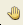
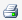
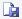
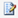
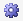

# Generate Reports Overview

It must be feasible to commercially produce volumes in order to consider
those volumes as reserves. The economic value is determined by
generating reports. A number of technical and economic reports are
included with
Value
Navigator.

Much like economics, reports can be run at any folder level or for any
individual entity. With selection of a folder in the Entity Explorer,
the value of each well in that folder is calculated. The values are
aggregated for all wells in the folder for the selected reserves
category when an Economic report is selected on the Reports tab.

Two features are available for the generation of predefined reports:

- Reports tab: generate one report at a time for a single entity or
  folder, in the current reserves category and plan. The Reports tab is
  available in both Entity View and Data View.
- Batch Manager: generate multiple reports on multiple folders and
  entities in multiple reserves categories and plans. The Batch Manager
  feature includes the opportunity to vary parameters for the selected
  entities for scenario analysis. Batch Printing can be done from Batch
  Manager by altering the Report List so that it contains only one or
  two reports.

## Reports Tab

The Reports tab is the quickest and simplest reporting method. It allows
you to view one report at a time, on a single entity or folder in one
reserves category. The report last run is selected by default; other
reports can be selected from the pull-down menu of available reports.
The Reports tab is available in both Entity View and Data View.

When an economic report is selected on the Reports tab, an economic case
will automatically be generated if there is a production forecast. The
economic evaluation of the selected entity will be updated if any
changes have been made to the entity since the economics were last run.
If a folder has been selected, the economic evaluation of all entities
in the folder will be performed and aggregated to the folder level
total.

To view reports on the Reports tab

1.  In the Entity Explorer, select an entity or a folder.
2.  Select the desired Plan and Reserves Category.
3.  Select the Reports tab.
4.  Select a report from the Report list.

## Report Tab Functions

| Function | Icon | Description |
|----|----|----|
| Page |   | Reports may have a number of pages. Use the step icons to step through the pages of the report. |
| Zoom |   | The zoom used to display the report can be set. You can also zoom in with a double-left-click, and zoom out with a double-right-click. |
| Pan Mode | 

 | Click and drag the page with the left mouse button |
| Select Mode | 

   | Click and drag to select a subset of the information displayed on the page for pasting into some other product. |
| Print Setup | 

   | Setup the printer by selecting the printer, paper and orientation. This will override the default printer set for the PC. |
| Print | 

   | Open the Print dialog to select a printer to send the report to. The default Windows printer will be selected automatically. |
| Export | 

   | Export the report to a PDF, HTML or CSV file. The CSV file can be opened in Excel. |
| Open as Spreadsheet |   

 | Open the report directly into an Excel spreadsheet. |
| Edit Report | 

   | Open the Report Designer to modify a built-in Economic report. |
| Settings | 

   | Disable the unit scaling. Force all auto-scaled values in reports to use standard units. Example: Gas volumes may be set to Bcf on large volume wells unless this option is disabled to ensure Mcf are displayed. |
| Report |   | Displays the name of the report being generated. |
| Reports… |   | Select the reports to be made available in the pull-down list for easy selection. |
| Results |   | Select a Plan and result type to use in generating the results. When the reserves category selected is PD or TP (of the appropriate reserves class), choose to generate the report for the total category (Input) or the wedge. Running the wedge report will generate PNP results from the PD reserves category or PUD results from the TP reserves category. |
| Scenario |   | Choose from 2 predefined scenarios, the Default (\) using the active price deck, or the Reserves (\) using the reserves price deck. As other scenarios are defined, they will be available for selection. |
| Currency |   | The selected report can be produced in any currency defined in the project. By default, the currency used will be the Project Currency when a folder is selected or the entity currency for an entity. |
