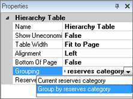

# Add Reserves Categories to Report Designer Reports

Report Designer reports can contain rows for several reserves
categories. You can only add reserves categories to Hierarchy Tables,
not Monthly/Annual Tables.

To add reserves categories to Report Designer report

1.  [Create a Report in the Report Designer](Create%20a%20Report%20in%20the%20Report%20Designer.md) or
    open a report you already created.
2.  Click the table you want to add reserves categories to.
3.  Under Properties (bottom left), change the Grouping to Group by
    reserves category.
    

4.  In the **Reserves Category** row (below **Grouping**), select the
    reserves categories you want to add to the table.
5.  A new row for each reserves category is created in the report table.
