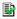

# Create a Report Copy

You can make a copy of a report, edit it, and save it with a new name.
Unlike a report version, report copies are displayed in the reports list
and not related to their source report.

See [Creating a Report Version vs. Creating a Report Copy](Creating%20a%20Report%20Version%20vs%20Creating%20a%20Report%20Copy.md).

To create a report copy in the Report Designer

1.  In the toolbar, click the **Select/Manage Reports** icon
.
2.  Under Available Reports, select the report you want to copy and
    click **Edit Report**.\
    The Report Version Manager is displayed.
    

    You can only create report copies for Report Designer reports, which
    have this icon in the report list: 

    
3.  Click the report version you want to copy and click **Create Copy**.
4.  Under Location, select the **Local** or **Global** folder.
5.  Select **New** report and enter a name.
6.  Click **Save**.
7.  Close the Report Version Manager and return to the Select/Manage
    Reports dialog box.
8.  Select the report copy and click **Edit Report**.\
    The Report Version Manager is displayed.
9.  Click **Edit**.\
    The Report Designer is displayed.
10. Edit the new report and click **Save**.

See [Create a Report in the Report Designer](Create%20a%20Report%20in%20the%20Report%20Designer.md).
