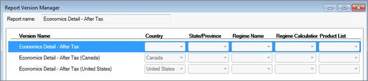
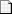
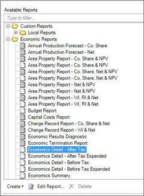
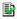

# Create a Report Version

Report versions are reports based on a source report and related to it.
Report versions are variations of their source and are automatically
displayed when the selected entity’s criteria match the report’s
criteria.

In Value
Navigator, some reports have versions built in. For example, the
Economic Detail-After Tax report has three versions: Canada, US, and
Undefined. When you run reports, you do not need to select the Canadian
version when reporting on Canadian entities or the US version when
reporting on US
entities—Value
Navigator automatically detects the entity’s country and
generates the appropriate report. The Undefined version is automatically
used for all other countries.

With the Report Version Manager, you can create custom versions of
economic reports to streamline the reporting process. You can create
versions based on country, state or province, regime, regime
calculation, or product list. Then when you are reporting on entities
with a mix of criteria, you only need to select one report rather than
selecting a separate report for each entity.

The Economic Detail-After Tax report in the Report Version Manager. The
first version (undefined) is used when the country is anything but
Canada or the United States.

Keep in mind that you can only create report versions for economic
reports that are editable in the **Report Designer**. In the
**Select/Manage Reports** dialog box, editable reports are indicated
with this icon: .

To create a report version in the Report Designer

1.  In the toolbar, click the **Select/Manage Reports** icon
.
2.  Under **Available Reports**, select the report you want to create a
    new version for and click **Edit Report**.\
    The Report Version Manager is displayed.
    

    You can only create report versions for Report Designer reports,
    which have this icon in the report list: 

    
3.  Click the report version you want to create a version for and click
    **Create Copy**.
4.  Under Location, select the **Local** or **Global** folder.
5.  Select **Existing Report** and enter a new Version name.
6.  Click **Save**.
7.  In the Report Version Manager, edit the relevant version criteria
    (Country, State/Province, Regime Name, Regime Calculation, or
    Product List).
8.  Click the version and click **Edit**.\
    The Report Designer is displayed.
9.  Edit the new report and click **Save**.

Click **Sort by Priority** to display the report versions in the
priority in which they will be used.

See [Create a Report in the Report Designer](Create%20a%20Report%20in%20the%20Report%20Designer.md).
