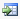

# Create a Report in the Report Designer

The Report Designer is a tool for quickly building custom reports using
many of the components found in
Value
Navigator economic reports.

You cannot use the Report Designer to create or edit technical reports.

You can edit reports you created in the Report Designer directly from
the **Reports** tab. When you have a Report Designer report selected,
the **Edit Report** icon () is displayed in the
**Reports** tab tools.

Once you have
[Create a New Report](Create%20a%20New%20Report.md) a
[Create a Report Version](Create%20a%20Report%20Version.md), or a
[Create a Report Copy](Create%20a%20Report%20Copy.md) the Report Designer is displayed. The procedures below
explain how to build and edit a report.

To create a report in the Report Designer

1.  Do one of the following:
    | To… | Do this… |
    |----|----|
    | Create a simple monthly or annual report to which you can add components (such as Cash Flow or Costs), | Under Controls, drag a Graph, Monthly/Annual Table, Monthly Annual Table (Transposed)\*, or Hierarchy Table control to the Edit window on the right. \*Transposed tables have dates along the top of the report. |
    | Create a more complex report using a template to which you can add components (such as Cash Flow or Costs), | Under Templates, drag a report or report component to the Edit window. Click  to see components under a report. |
2.  Click a component in the **Edit** window to display components under
    **Toolbox**.
3.  From the **Toolbox** window, drag the components you want in your
    report to the Edit window and place them in the report.
4.  Click the **Preview** tab to preview the report.
5.  Click **Save**.

The report is saved in the
[Create a Report List](../Use%20the%20Batch%20Manager/Create%20a%20Report%20List.md) under Custom
Value
Navigator Reports with the following icon ().

See the sections below for common Report Designer tasks.

## Create and Edit a Report

| To… | Do this… |
| --- | --- |
| Undo a change, | Click  at the top of the designer. |
| Add a text area or page break, to the report, | Drag Text Area, Page Break, or Splitter from the Controls to the Edit window. You cannot add a page break to a splitter. |
| Add a splitter to a report, | Drag a component in the Edit window beside another component. The two components are moved inside a splitter. You cannot add page breaks or transposed tables to a splitter. |
| Create Custom Results Fields | Select the custom result field from the Toolbox (in the After Tax Custom Results folder or the After Tax Custom Results folder). |
| Remove a component from the report, | Click  in the top right corner of a component in the Edit window. |
| Move a component in a report, | Drag the component to a new location in the Edit window. |
| Duplicate a report component or column, | Click the report component or click in a column and then right-click and select Duplicate. |
| Display the report in Excel, | At the top of the Preview window, click . |

## Change Report Properties

| To… | Do this… |
|----|----|
| Change the report units, | At the top of the designer, click  or . |
| Show or hide empty dates, | In the **Edit** window, click the grid (blank area). Under **Properties, select True** or **False.** This setting affects Monthly Annual Tables and Monthly Annual Transposed tables. It fills in empty steps from the Reference Date to the first step with data for wells that come on after the Reference Date. This option makes the grid dates consistent in that all reports have the same start date (i.e. they all start at the Reference Date). |
| Change the report name, orientation, or alignment, | In the **Edit** window, click the grid (blank area). Under **Properties**, edit the **Report Name**, **Orientation**, or **Alignment**. |
| Switch between the expanded and summarized view, | In the **Edit** window, click the grid. Under **Properties**, edit the **Report Display Mode**. |
| Change how the Reference Date is displayed, | In the **Edit** window, click the grid. Under **Properties**, select a **Reference Date Text Option**. |
| Add a description, | In the **Edit** window, click the grid. Under **Properties**, Enter **Description** text. The text is displayed under Report Description when the report is selected in the **Select/Manage Reports** dialog box. |

## Change Report Component Properties

| To… | Do this… |
|----|----|
| Change a component’s width, height, or alignment, | Click a component in the **Edit** window and edit the properties under **Properties** on the left. |
| Change  a splitter’s width or number of columns, | Click a splitter in the **Edit** window and edit the properties under **Properties** on the left. |

## Select Entities to Preview

| To… | Do this… |
|----|----|
| Preview a different entity, plan, or reserves category, | At the top of the designer, click  next to the entity name. |
| Preview a Bulk Well Schedule, Common Termination Entity, or Ring Fence, | At the top of the designer, click  next to the entity name. |

## Change Report Calculations

| To… | Do this… |
|----|----|
| Pro-rate taxes, | In the **Edit** window, click the grid (blank area). Under **Properties**, select **True** for **Pro-rate taxes**. |
| Add a formula to the report, | At the top of the designer, click 0. See [Add a Formula to a Report in the Report Designer](Add%20a%20Formula%20to%20a%20Report%20in%20the%20Report%20Designer.md) for more information. \` |
| Specify the calculation method for the Total in the Monthly/Annual Table | In the **Edit** window, click the **Monthly/Annual Table**. In the menu bar at the top of the **Edit** window, select one of the following options next to **Total Method**: None: Does not display a total for the column/row Default (for non-formulas): Displays the regular total. This is the only option for non-formulas. Sum (for formulas): Calculates the total by summing the value that was calculated for each row. Use this option for formulas that should be summed, such as volumes or dollar amounts. For example, if you create a formula that calculates the discounted cash flow, then the total at the bottom of the table should be the sum of each year's values. Formula (for formulas): Calculates the total by re-running the formula on the field totals. Use this option for ratio formulas that should not be summed. For example, if you create a formula that divides volume by time to calculate rate, you do not want to sum up all the rates at the bottom of the table, you want to display the sum of volume divided by the sum of time. |
