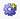

# Generate Reports on the Reports Tab

Selecting the **Reports** tab displays technical, economic, and custom
reports. If you select a report that requires economics,
Value
Navigator runs the economics.

## Reports Tab Interface

The **Reports** tab has four lists for selecting reports, reserves
categories, scenarios, and currencies. See the descriptions below.

- **Report**: Select a report from this list.
- **Reports**: Opens the Select/Manage Reports dialog box, which you can
  use to [Create a New Report](../Reports%20Designer/Create%20a%20New%20Report.md) or
  [Create a Report List](../Use%20the%20Batch%20Manager/Create%20a%20Report%20List.md).
- **Results**: Click  to select the results set (reserves
  plan, plan, or calculated plan) you want to see results for. You can
  also select an **Input** reserves category(report on currently
  selected reserves category) or **Wedge** reserves category(report on
  the difference between the currently selected reserves category and
  the next category with inputs above it).
- **Scenario**: Click  to select a scenario or
  jurisdiction already in the scenario list. Click **Scenarios** to add
  or edit scenarios. See [Create and Run a Scenario](../Use%20the%20Batch%20Manager/Create%20and%20Run%20a%20Scenario.md) (starting at step
  3).
- **Currency**: Click  to select a currency.

To generate a report on the Reports tab

1.  In the Explorer, select an entity or folder.
2.  In the **Summary** window, select a reserves category.
3.  Click the **Reports** tab.
4.  Select a report from the **Report** list. See
    [Create a Report List](../Use%20the%20Batch%20Manager/Create%20a%20Report%20List.md).
5.  Select a results set from the **Results** list and then select an
    **Input** or **Wedge** reserves category (if applicable).
6.  Select a **scenario** or **jurisdiction**, if required, from the
    **Scenario** list.
7.  Select a currency from the **Currency list**.

When you select a configurable report (custom reports or incremental
reports), the Options icon is displayed with a plus sign
(). Click the icon to edit the report configuration.
