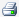
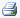

# Print Reports

To print a report on the Reports tab,
click **Print** .

To print a report in the Print Preview (accessed from the Batch
Manager): Click **Print** to print the currently
displayed report or click **Print All**  to print all the
reports in the report tree.

Also see
[Create a Report List](../Use%20the%20Batch%20Manager/Create%20a%20Report%20List.md).

You can print from anywhere in
Value
Navigator by selecting **Print** from the **File** menu or by
clicking the print icon on the toolbar ().
