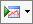

# Run Economics

Economic cases are generated when economic input parameters are entered
and saved or when economic reports are produced for entities with a
production forecast.

After importing production data, or when creating forecasts, build
economic cases for all entities in each reserves category that was
modified. Generate economics by selecting an entity or folder, then
clicking the Calculate Economics button
on the main toolbar (), and selecting a scenario to run.
To see an economic report, click the Reports
tab in Entity View or Data View and select any economic report.
Economics are not run when a technical report is selected.

You can run economics at any folder level by selecting a folder in the
Entity Explorer. When you run economics at the folder level, the
economics of each entity in the folder are run individually, then summed
and displayed in the report. To run folder level economics on multiple
wells that do not appear in the same folder, filter to those wells and
then choose the highest-level folder to report on.

If an entity has a current economic case, a green check mark appears
below the Economic Result Status icon () in the Reserves
Category window. Stale economics are indicated by a refresh icon (
). This indicator applies only to the default Current
Options scenario; running any other scenario will not update this
status. If a well is no longer producing, then there is no forecast; no
economic case will be created, and no report will be displayed.

If you want to see the total value of multiple wells, do not create a
group or rollup. Filter to the wells and run economics at the folder
level. See [About Groups](../Entity%20Management/Groups%20and%20Rollups/About%20Groups/About%20Groups.md) or [About Rollups](../Entity%20Management/Groups%20and%20Rollups/About%20Rollups/About%20Rollups.md) for a description of their uses.

You can calculate economics from anywhere in
Value
Navigator without generating reports by clicking the **Calculate
Economics** button in the toolbar ().

To calculate economics

1.  In the Entity Hierarchy, select the entities or folders you want to
    calculate.
2.  Select the **Plan** and **Reserves Category** (located below the
    Entity Hierarchy) you want to calculate.
3.  Click  in the toolbar.
4.  From the list of scenarios, select the **Scenario** you want to
    calculate.
5.  Click **Calculate Economics**.
